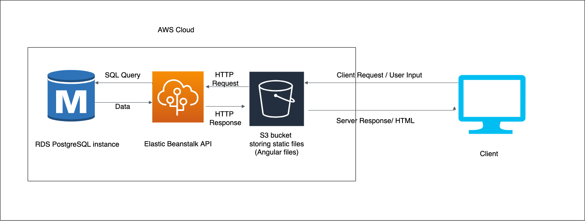

# Infrastructure Description

## The infrastructure of the application is deployed and mantained on AWS

  

### Services Used

- RDS as the primary database storage
- Elastic Beanstalk to store and run the server
- S3 to store static files and frontend

 

### Architecture Diagram

